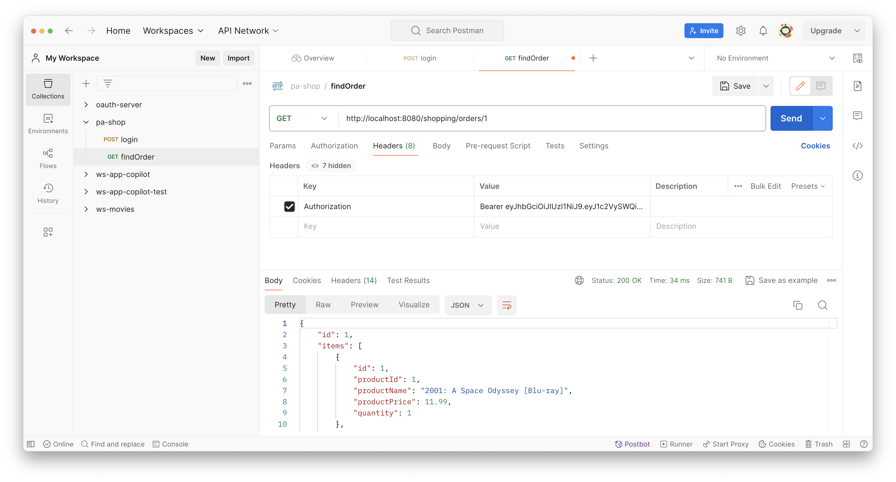

# Tareas para la semana del 11 de marzo

Para completar el backend ya sólo os queda implementar la capa de Servicios REST. Para comprobar el correcto funcionamiento del backend, debéis emplear un cliente REST (e.g. Postman).

A continuación se comentan algunos aspectos concretos a tener en cuenta.

## Cómo pasar la cabecera Authorization con Postman

Como aprendimos al final del tema 4, para las peticiones que requieran conocer la identidad del usuario, es necesario pasar la cabecera `Authorization` con el token JWT usando el esquema `Bearer`.

Tras invocar al caso de uso de autenticación, se obtiene el token:


En las peticiones que requieran el token JWT, hay que añadir la cabecera `Authorization` (pestaña "Headers"):



Por último, recordad que los tokens JWT emitidos por el backend de vuestra práctica (y de pa-shop) tienen un tiempo de vida de 1 día. Debéis actualizar el valor de la cabecera `Authorization` en las peticiones que la usen cuando sea necesario.

## Control de acceso

Un aspecto a tener en cuenta es que tanto participantes como empleados deben poder editar la información de perfil y cambiar la contraseña. Para permitirlo, debéis cambiar ligeramente la configuración de base del control de acceso que figura en la clase `SecurityConfig`. Por ejemplo, asumiendo que hayáis modificado `User.RoleType` para que tenga los valores `PARTICIPANT` y `EMPLOYEE` (en lugar de `USER`), podéis hacer el siguiente cambio en `SecurityConfig`:

```diff
...
			.requestMatchers(HttpMethod.POST, "/users/loginFromServiceToken").permitAll()
-			.requestMatchers(HttpMethod.PUT, "/users/*").hasRole("USER")
-			.requestMatchers(HttpMethod.POST, "/users/*/changePassword").hasRole("USER")
+			.requestMatchers(HttpMethod.PUT, "/users/*").hasAnyRole("PARTICIPANT", "EMPLOYEE)
+			.requestMatchers(HttpMethod.POST, "/users/*/changePassword").hasAnyRole("PARTICIPANT", "EMPLOYEE")
			.anyRequest().denyAll();
...
```

Recordad, además, añadir las reglas de control de acceso propias de vuestra práctica.

## Parámetros LocalDate en métodos de controladores

Para invocar el caso de uso de búsqueda de pruebas deportivas del backend, será necesario hacer una petición del estilo `GET /eventsearch/events?provinceId=1&eventTypeId=2&startDate=2024-05-01&endDate?2024-05-15`. Para hacer que el método del controlador que procesa esta petición pueda recibir las fechas en los parámetros correspondientes, podéis proceder de la siguiente manera: 

```java
@RestController
@RequestMapping("/eventsearch")
public class CatalogController {

	...

    @GetMapping("/events")
    public ... findEvents(
        @RequestParam(required=false) Long provinceId,
        @RequestParam(required=false) Long eventTypeId, 
        @RequestParam(required=false) @DateTimeFormat(iso = DateTimeFormat.ISO.DATE) LocalDate startDate,
        @RequestParam(required=false) @DateTimeFormat(iso = DateTimeFormat.ISO.DATE) LocalDate endDate) {
        ...
    }

	...

}	
```

La anotación `@DateTimeFormat` sobre sobre los parámetros `startDate` y `endDate` provocará que los valores de los parámetros HTTP `startDate` y `endDate` se conviertan automáticamente a `LocalDate`.
